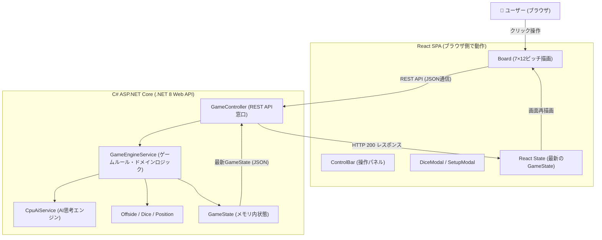

# Positional Tactics (ポジショナル・タクティクス)
### 〜 チェスと将棋の思考で遊ぶ、本格ターン制サッカーボードゲーム 〜

[](https://github.com/akb48ske48andgamba7/FootballBoardGame/actions/workflows/deploy.yml)

本プロジェクトは、現代サッカーの戦術理論**「ポジショナルプレー (5レーン理論を発展させた7レーン)」**の奥深さを、将棋やチェスのように盤上で体感できるフルスタック・ターン制サッカーボードゲームです。

バックエンドに **C# (.NET 8 ASP.NET Core)**、フロントエンドに **React (TypeScript + Vite)** を採用し、Google Cloud (Cloud Run) 上で本番稼働しています。

> 🌐 **本番公開URL**: [https://football-board-game-trgplfi7xq-an.a.run.app](https://football-board-game-trgplfi7xq-an.a.run.app)  
> 📖 **GitHub リポジトリ**: [akb48ske48andgamba7/FootballBoardGame](https://github.com/akb48ske48andgamba7/FootballBoardGame)

---

## 📚 目次
1. [🌟 ゲームのルールと特徴](#-ゲームのルールと特徴)
2. [🏗️ 全体アーキテクチャ解説 (Webシステムの仕組み)](#-全体アーキテクチャ解説-webシステムの仕組み)
3. [🔷 C# バックエンド学習ガイド (オブジェクト指向・DDD・アルゴリズム)](#-c-バックエンド学習ガイド)
4. [⚛️ React フロントエンド学習ガイド (コンポーネント・Hooks・非同期通信)](#-react-フロントエンド学習ガイド)
5. [☁️ クラウド & CI/CD 自動化 (Docker・GitHub Actions・Cloud Run)](#-クラウド--cicd-自動化)
6. [🚀 ローカル環境での起動手順](#-ローカル環境での起動手順)

---

## 🌟 ゲームのルールと特徴

### 1. ピッチの構成 (縦7分割 × 横12マス)
- **縦7レーン**: 現代サッカーの「5レーン理論」をさらに細分化した本格設計。
  - `上サイド` / `上ハーフ` / `上インサイド` / `センター` / `下インサイド` / `下ハーフ` / `下サイド`
- **横12マス**: 左右のゴール（左: Col 0 / 右: Col 13）の間を攻防します。
- **ペナルティエリア**: ゴール手前の横2列 × 縦3行（計6マス）。GKが手を使って守れる特別なエリアです。

### 2. 15種類の有名フォーメーション選択 ＆ 能力値の自由配分
- **有名フォーメーション15種**: 4-3-3、4-4-2、3-5-2、4-2-3-1、4-1-4-1、3-4-2-1、ゼロトップなど、世界の戦術から選択可能。
- **能力値の配分ルール**:
  - **能力3 (★3: エース)**: チームに1名。サイコロ勝負に+3の強力な補正がつきます。
  - **能力2 (★2: 主力)**: **最大4名まで**自由に設定可能。
  - **能力1 (★1: 一般)**: 残りの選手（6〜10名）。
  - GKやDF、MF、FWのどこにエースや主力を配置するかはプレイヤーの戦術次第です。

### 3. 1ターンのアクション (順序自由)
- **選手の移動**: 1ターンに**最大3回**まで。
  - 前後左右斜めの8方向に「1〜2マス」移動可能。
  - **同一選手の複数回移動が可能！**（同じエースFWを3回動かして一気に6マス突破するドリブルも可能）。
- **パス / シュート**: 1ターンに**最大2回**まで。
  - 縦・横・斜めの直線方向に**最大6マス以内**で通すことができます（相手ゴール枠へのシュートも6マス以内からのみ可能）。
- **GK特権**: GKがボールを保持しているターンに限り、通常の3回移動とは別に「GK自身を追加で1回移動」可能。

### 4. 特殊ルール
- **オフサイド**: パスを出した瞬間、受け手が「相手最後尾DF（GK除く）の列」より相手ゴール側にいるとオフサイド反則となり即座に手番交代。ピッチ上に赤い警告ラインが表示されます。
- **サイコロ勝負 (デュエル)**:
  - **タックル**: 相手ボール保持マスに侵入すると発生（**1人の選手につき1ターン1回まで**）。
  - **パスカット / シュート阻止**: パスやシュートの直線コース上に相手選手がいると発生。
  - **勝敗判定**: `(能力合計 ＋ サイコロ出目 1〜6)` が大きい側が勝利！画面下部の合計値・メーターに出目がリアルタイム加算されます。
  - **GKボール保持時のタックル禁止 (GK保護)**: ゴールキーパーがボールを保持している間は、相手選手はGKへタックルに行くことができません。
  - **GKの手守備 (能力+1)**: ペナルティエリア内でシュートを打たれた際、GKは手を使って守るため「能力+1」のボーナスを獲得。
  - **シュートコース上DF数によるGK能力加算 (+1/名)**: シュートコース上に相手ディフェンダーがいた場合、ディフェンダーの人数分だけGKの能力が「+1」加算（コース限定・壁ブロック補正）。守備側DFの配置がGKのセービング力を直接向上させます。
  - **自陣一致の左右配置**: 仕掛けた側・受け側にかかわらず、サイコロ対決画面は常にピッチ自陣と同じ左右配置（前半: 左Blue/右Red, 後半: 左Red/右Blue）で表示され、役割（⚔️ ATTACK / 🛡️ DEFENSE）のバッジが明記されます。
  - **結果表示**: 勝敗確定後、結果を**約3秒間保持**（出目や勝敗メッセージをじっくり確認可能。OKボタンで即時進行も可能）。
- **ゴール後のキックオフ復帰**:
  - 得点が入ると、実際のサッカー同様に**両チームの全選手が自陣の初期フォーメーション配置へ自動復帰**。
  - 失点したチームのキックオフ担当（#10）がセンターサークル中央からボールを持って試合を再開します。

### 5. 対戦モード
- **1人対戦 (vs CPU)**: 高度な戦況判断AIと対戦。
- **2名対戦 (ローカル対戦)**: 1台の端末で交互に操作して友達と対戦。

---

## 🏗️ 全体アーキテクチャ解説 (Webシステムの仕組み)

このアプリケーションは、業界のデファクトスタンダードである「**フロントエンドとバックエンドの完全分離アーキテクチャ**」を採用しています。



### なぜバックエンド(C#)とフロントエンド(React)を分けるのか？
1. **ルールの改ざん防止 (チート対策)**:
   - ブラウザ側（JavaScript）だけでルールを計算すると、ユーザーがコードを書き換えてズルができてしまいます。
   - すべての判定（移動距離、オフサイド、サイコロ、得点）をサーバー側（C#）で厳密に計算することで、安全で公平なゲームが成立します。
2. **保守性とテストのしやすさ**:
   - 画面の見た目（UIデザイン）を変えても、ゲームのルール判定（C#）には影響しません。
   - `dotnet test` コマンド1つで、ブラウザを起動することなくルールの正確性を一瞬でテストできます。

---

## 🔷 C# バックエンド学習ガイド

C#はMicrosoftが開発した、美しく安全で世界最高峰のパフォーマンスを持つオブジェクト指向言語です。本プロジェクトには、C#学習に最適なベストプラクティスが凝縮されています。

### 1. レコード型 (`record`) と値の不変性 (`Position.cs`)
```csharp
// 座標を表すレコード型
public record Position(int Row, int Col)
```
- **class と record の違い**:
  - 一般的な `class` は「参照（ポインタ）」で比較されるため、別インスタンスだと `pos1 == pos2` が false になります。
  - `record` は「**値そのもの（RowとCol）が同じなら同一**」と自動判定されます。座標データに最適です。

### 2. チェビシェフ距離 (Chebyshev Distance) の計算
将棋の王将やチェスのキングのように、「8方向すべてを1歩で動けるマス目での距離」を計算する数式です。
```csharp
public int ChebyshevDistance(Position other) =>
    Math.Max(Math.Abs(Row - other.Row), Math.Abs(Col - other.Col));
```
- 横に2マス、縦に1マス離れている場合、斜めに1歩＋横に1歩で計2歩で到達できるため、`max(1, 2) = 2` となります。

### 3. LINQ (言語統合クエリ) の威力
C#最大の特徴である `LINQ` を使うと、複雑な選手の検索や集計をSQLのように1行で書けます。
```csharp
// 「現在ボールを持っている味方以外の選手」を「ゴールに近い順」に並び替えて1人取得する
var bestTeammate = state.Pieces
    .Where(p => p.Team == cpuTeam && p.Id != ballHolder.Id)
    .OrderBy(p => p.Position.ChebyshevDistance(targetGoal))
    .FirstOrDefault();
```

### 4. 依存性の注入 (Dependency Injection: DI)
```csharp
public GameEngineService(IDiceService diceService, IOffsideRuleService offsideService)
```
- クラスの中で直接 `new DiceService()` を作らず、外からインターフェースを受け取ります。
- これにより、テスト時に「必ず6が出るテスト用サイコロ」に差し替えるといった柔軟な設計が可能です。

### 5. フェイルセーフ設計 (障害耐性) (`CpuAiService.cs`)
```csharp
try {
    // CPUの思考・移動処理
}
catch (Exception ex) {
    // 万が一AIがエラーを起こしても、ゲームをフリーズさせず
    // 安全にターンを終了して人間のプレイヤーに手番を返す
    state = _gameEngine.EndTurn();
}
```
「万が一想定外のエラーが起きてもシステム全体を停止させない」という、商用システムで必須の設計思想です。

---

## ⚛️ React フロントエンド学習ガイド

Reactは、Meta社が開発した世界で最も普及しているフロントエンドUIライブラリです。

### 1. コンポーネント指向 (パーツの分割)
画面をレゴブロックのように独立した小さな部品（コンポーネント）に分割して作ります。
- `Board.tsx`: サッカーピッチの描画
- `PieceToken.tsx`: 選手コマの描画（★3のゴールドオーラ、背番号、ボール保持マーク）
- `DiceModal.tsx`: サイコロ勝負のポップアップ
- `SetupModal.tsx`: フォーメーションと能力値設定画面

### 2. React Hooks (フック) の3大基本
1. **`useState` (状態の記憶)**:
   ```typescript
   const [state, setState] = useState<GameState | null>(null);
   ```
   `setState` を呼ぶと、Reactが自動的に画面を差分更新（再レンダリング）します。
2. **`useEffect` (副作用とライフサイクル)**:
   ```typescript
   useEffect(() => {
     loadGameState(); // 画面が開いた初回に1度だけ実行
   }, []);
   ```
3. **`useRef` (再描画を起こさない変数)**:
   ```typescript
   const isCpuRunningRef = useRef(false);
   ```
   CPUの処理中に二重で実行されないよう、画面の再描画を伴わない安全なロック変数として使います。

### 3. CSS Grid によるピッチのレイアウト (`board.css`)
```css
.pitch-grid {
  display: grid;
  grid-template-columns: repeat(12, 1fr); /* 横12等分 */
  grid-template-rows: repeat(7, 1fr);    /* 縦7等分 */
}
```
CSS Grid を使うことで、スマホや大型モニターなど画面サイズが変わっても、縦横の比率を保ったまま美しいマス目が自動計算されます。

---

## ☁️ クラウド & CI/CD 自動化

本プロジェクトは、現代のWebエンジニアが現場で実践する「**GitOps / CI/CD**」を完全自動化しています。

### 1. Docker マルチステージビルド (`Dockerfile`)
1つの Dockerfile の中で、
1. **Node.js 環境**: React フロントエンドを高速ビルドして静的ファイルを出力。
2. **.NET SDK 環境**: C# バックエンドをコンパイル。
3. **軽量ランタイム環境**: 出来上がった成果物だけを最小サイズのLinuxコンテナに詰めて配布。
これにより、サーバーの起動が数秒で完了し、メモリ消費も最小限に抑えられます。

### 2. GitHub Actions (`.github/workflows/deploy.yml`)
`git push origin main` を実行すると、クラウド上のロボットが自動起動します：
1. **自動テスト**: `dotnet test` でルールが壊れていないか自動検証。
2. **自動ビルド**: フロントとバックエンドを自動ビルド。
3. **Google Cloud Run へ自動配備**: Google Cloud へ最新のコンテナを即座に安全デプロイ。

---

## 🚀 ローカル環境での起動手順

自分のPC上でコードを変更して動かしてみたい場合のステップです。

### 必要なツール
- [.NET 8 SDK](https://dotnet.microsoft.com/download/dotnet/8.0)
- [Node.js (v18以上)](https://nodejs.org/)

### コマンド一覧
```bash
# 1. リポジトリをクローン
git clone https://github.com/akb48ske48andgamba7/FootballBoardGame.git
cd FootballBoardGame

# 2. フロントエンドをビルド
npm --prefix src/Client run build

# 3. 単体テストを実行して動作確認
dotnet test

# 4. アプリケーションを起動
dotnet run --project src/Server
```

起動後、ブラウザで **`http://localhost:5281`** を開くとすぐに遊ぶことができます！

---

## 🏆 学習のヒント
コードを読む際は、以下の順番で見ていくと全体の流れがすっきりと理解できます：
1. `src/Server/Models/Position.cs`（マス目と距離の計算）
2. `src/Server/Models/GameState.cs`（ゲームデータの全体構造）
3. `src/Server/Services/GameEngineService.cs`（ルールとアクションの実装）
4. `src/Server/Services/CpuAiService.cs`（AIの思考手順）
5. `src/Client/src/App.tsx`（Reactとサーバーの連携）
6. `src/Client/src/components/Board.tsx`（ピッチの描画とクリック操作）
